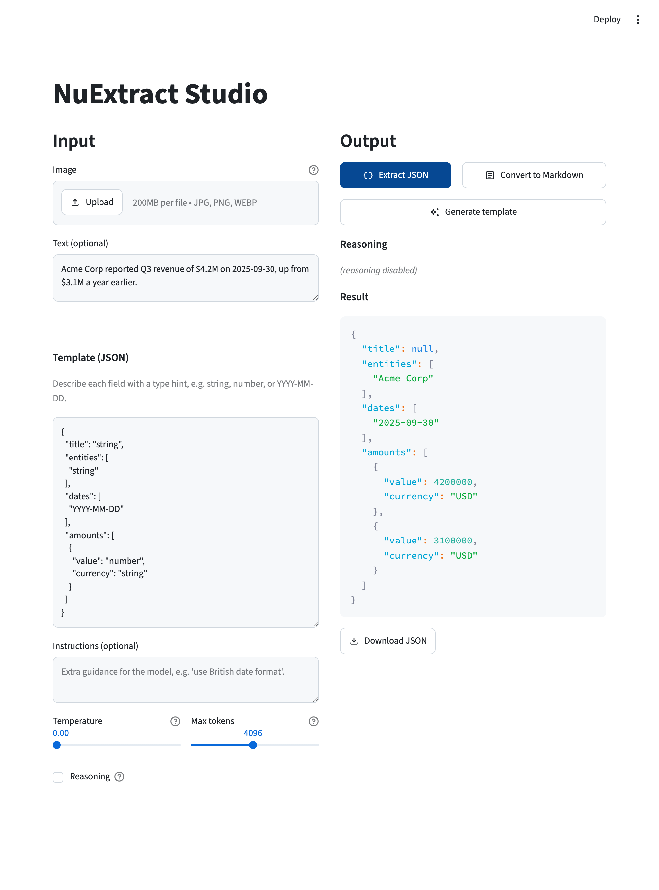
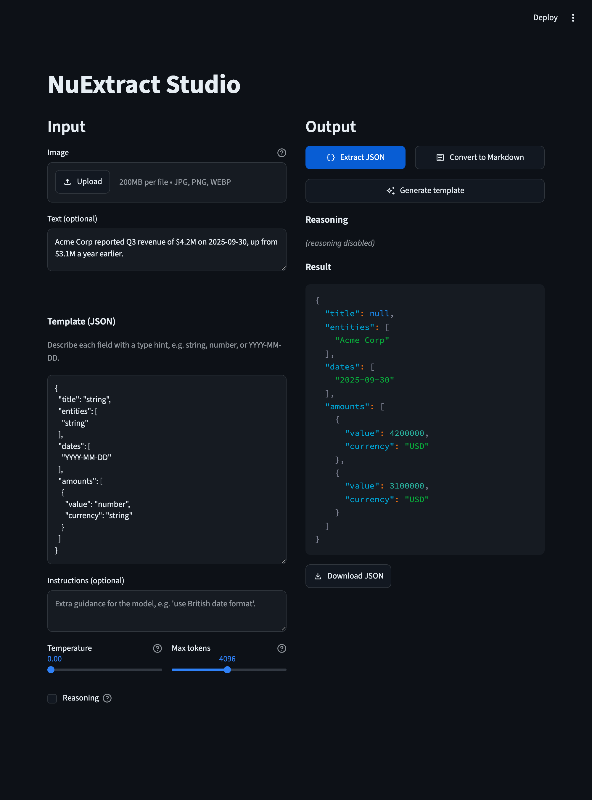

# NuExtract Studio

[](https://github.com/darylalim/nuextract-studio/actions/workflows/ci.yml)
[](LICENSE)
[](pyproject.toml)
[](#requirements)

Streamlit application for structured extraction, document understanding, and template generation with NuMind NuExtract on Apple Silicon with MLX. Mirrors the [official NuExtract3 Hugging Face Space](https://huggingface.co/spaces/numind/NuExtract3) but runs entirely locally via [mlx-vlm](https://github.com/Blaizzy/mlx-vlm) — no discrete GPU, CUDA, or external API required (inference runs on the Apple GPU via MLX/Metal).

| Light theme | Dark theme |
|:---:|:---:|
|  |  |

## Features

- **Three modes** — structured JSON extraction, document-to-markdown conversion, and natural-language → template generation
- **Multimodal input** — upload an image (screenshot, scan, photo) and/or paste text
- **Typed template system** — `verbatim-string`, `string`, `integer`, `number`, `date`, `boolean`, enums, multi-enums, and more (see [TYPES.md on Hugging Face](https://huggingface.co/numind/NuExtract3/blob/main/TYPES.md))
- **Custom instructions** — an optional free-text field to steer extraction (e.g. "use British date format")
- **Tunable generation** — temperature (0.0–1.0, default 0.0) and max-tokens (256–8192, default 4096) sliders
- **Streaming output** — results stream in token-by-token
- **Optional reasoning mode** — for Extract JSON and Convert to Markdown, the model emits `<think>...</think>` traces shown in a dedicated pane (template generation always runs without reasoning)
- **Download buttons** — save the JSON, markdown, or generated template to disk
- **Local Apple Silicon inference** — no API key or network calls during extraction

## Requirements

- macOS with Apple Silicon (M1/M2/M3/M4)
- Python 3.12+ (installed automatically by uv — no separate Python setup needed)
- ~6 GB free disk — the model is ~5 GB (downloaded on first run), plus headroom
- 16 GB unified memory recommended (more is better for long-context inference)

## Quickstart

This project uses [uv](https://docs.astral.sh/uv/) for dependencies and Python. Install it first if you don't have it:

```bash
curl -LsSf https://astral.sh/uv/install.sh | sh
```

Then clone and run (uv installs a matching Python 3.12 and all dependencies for you):

```bash
git clone https://github.com/darylalim/nuextract-studio.git
cd nuextract-studio
uv sync
uv run streamlit run streamlit_app.py   # opens http://localhost:8501
```

**First run** downloads the ~5 GB model (on top of the Python dependencies pulled during `uv sync`), so budget a few minutes on a typical connection. The browser shows a "Loading model (first run downloads ~5 GB)" spinner and will look idle while the download runs in the terminal — this is normal. Later runs load from the local Hugging Face cache in seconds. Press Ctrl-C in the terminal to stop the app.

## Modes

| Button | Inputs | Output |
|---|---|---|
| **Extract JSON** | Image and/or text + JSON template | Structured JSON matching the template |
| **Convert to Markdown** | Image (required) | Clean markdown with HTML tables and embedded structure |
| **Generate template** | Image or text describing the document | A JSON template you can paste back into the editor |

## Try it: your first extraction

The app opens with a ready-to-use JSON template, so you can extract from plain text with no setup:

1. Paste text into the **Text** box, e.g.:
   > Acme Corp reported Q3 revenue of $4.2M on 2025-09-30, up from $3.1M a year earlier.
2. Leave the default **Template (JSON)** as-is (it extracts `title`, `entities`, `dates`, and `amounts`).
3. Click **Extract JSON**.

JSON streams into the Result pane, for example:

```json
{
  "title": null,
  "entities": ["Acme Corp"],
  "dates": ["2025-09-30"],
  "amounts": [
    {"value": 4200000, "currency": "USD"},
    {"value": 3100000, "currency": "USD"}
  ]
}
```

Exact values vary with the model; fields it can't fill come back `null` (here the text has no explicit title). Then edit the template to change what gets pulled out, or upload an image and use **Extract JSON** / **Convert to Markdown** to work from a scan or screenshot.

## Limitations

- **No PDF support** — matches the upstream HF Space. Convert PDFs to images (PNG/JPG) externally before uploading.
- **One image per run** — the uploader takes a single image (JPG, JPEG, PNG, or WEBP); it does not batch multiple pages.
- **No clipboard paste** — images must be uploaded as files (a Streamlit limitation vs the Gradio-based HF Space).
- **Apple Silicon only** — inference runs through MLX, which requires an arm64 Mac.

## Troubleshooting

- **`command not found: uv`** — install uv (see [Quickstart](#quickstart)), then restart your shell.
- **Not on Apple Silicon** — MLX runs only on Apple-Silicon Macs (M1–M4). On Intel Macs, Linux, or Windows the model will fail to load and there is no CPU/CUDA fallback. Use the [hosted HF Space](https://huggingface.co/spaces/numind/NuExtract3) instead.
- **First run looks stuck** — it's downloading the ~5 GB model; watch progress in the terminal, not the browser. Interrupted downloads resume on the next run (Hugging Face caches partial files).
- **Out of memory or very slow generation** — the 8-bit model needs ~5–6 GB of unified memory plus KV cache. On 16 GB machines, close other apps, lower **Max tokens**, and keep inputs shorter.
- **`Qwen3VLImageProcessor` / transformers errors** — dependency versions are pinned in `pyproject.toml` (notably `transformers==5.12.1` and `torchvision`, both required even for text-only runs). Run `uv sync` to restore the locked versions and avoid upgrading these manually.

## Development

```bash
uv run ruff check .      # Lint
uv run ruff format .     # Format
uv run ty check          # Type check
uv run pytest            # Tests (90)
```

`uv run python scripts/probe_mlx_vlm.py` runs an end-to-end probe (downloads the model and performs a real extraction) to verify the setup on a fresh machine.

CI (GitHub Actions, `macos-14` Apple Silicon runners) runs lint, format check, type check, and tests on every push and PR to `main`.

## Project Structure

```
streamlit_app.py                    # UI: two-pane layout, buttons + streamed output in an st.fragment
nuextract.py                        # mlx-vlm wrapper: load, render prompt, stream extraction
pyproject.toml                      # Dependencies (pinned) + ruff/ty/pytest config
.streamlit/
  config.toml                       # Theme: GitHub-inspired light/dark palette
scripts/
  probe_mlx_vlm.py                  # Verifies model + template kwargs flow-through end-to-end
tests/
  conftest.py                       # sys.path setup
  test_nuextract.py                 # Wrapper tests (40)
  test_streamlit_app.py             # App helper tests (25)
  test_streamlit_app_apptest.py     # End-to-end UI tests via Streamlit AppTest (25)
.github/workflows/
  ci.yml                            # Lint + format check + type check + pytest on macOS runners
  release.yml                       # Auto-publish a GitHub Release on version tags
```

## Contributing

Contributions are welcome. Before opening a PR against `main`, run the same gates CI enforces — all must pass:

```bash
uv run ruff check .
uv run ruff format --check .
uv run ty check
uv run pytest
```

Add or update tests where practical; the suite mocks the model so it runs fast (currently 90 tests). See [CLAUDE.md](CLAUDE.md) for an architecture overview.

## Acknowledgments

- Mirrors the architecture of the official [NuExtract3 Hugging Face Space](https://huggingface.co/spaces/numind/NuExtract3) (MIT) by [NuMind](https://numind.ai), reimplemented for local Apple Silicon inference.
- Uses the [`numind/NuExtract3`](https://huggingface.co/numind/NuExtract3) model (Apache-2.0, built on Qwen3.5-4B), run via the [`numind/NuExtract3-mlx-8bits`](https://huggingface.co/numind/NuExtract3-mlx-8bits) quantization. The model weights are downloaded at runtime and are not redistributed by this project.
- Built on [mlx-vlm](https://github.com/Blaizzy/mlx-vlm) and [Streamlit](https://streamlit.io).

## License

Released under the [MIT License](LICENSE). The NuExtract model weights are licensed separately (Apache-2.0) by NuMind.
